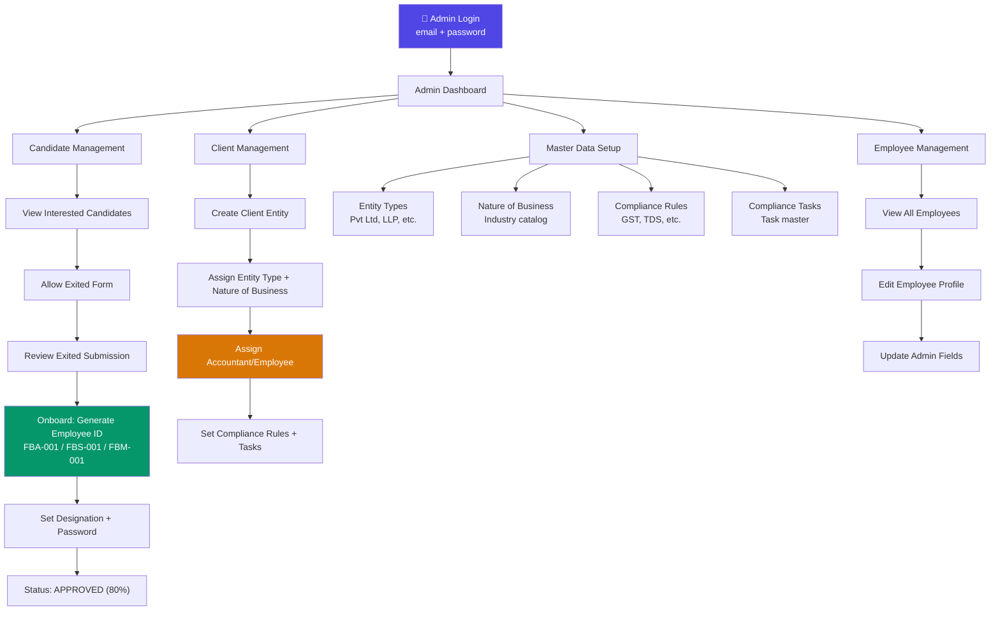
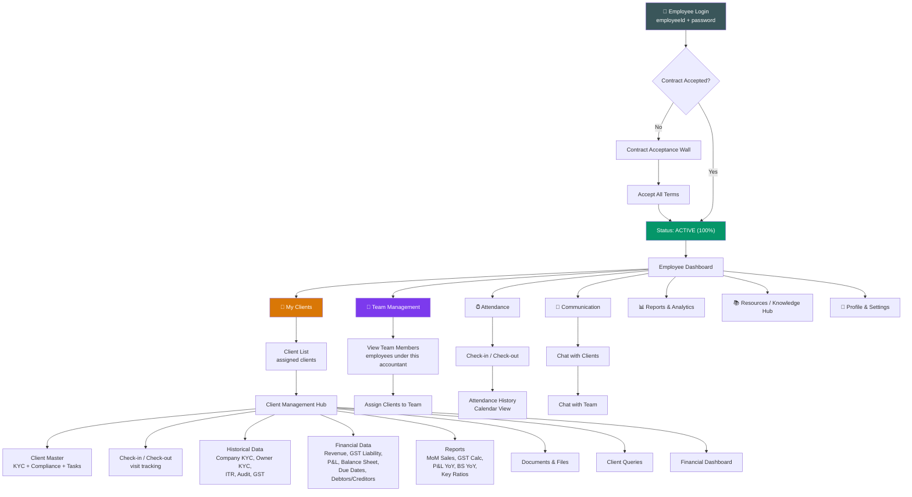
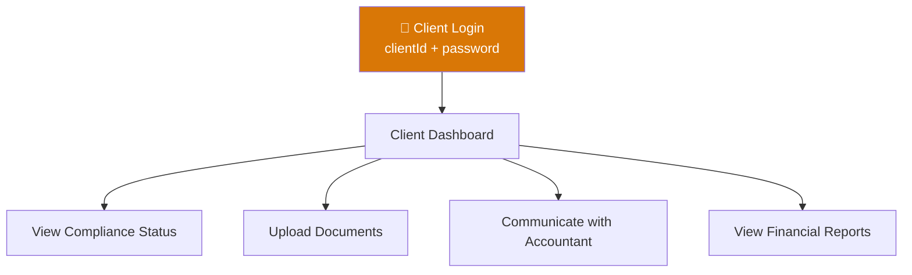
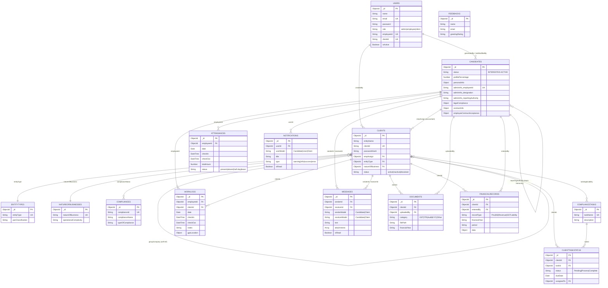
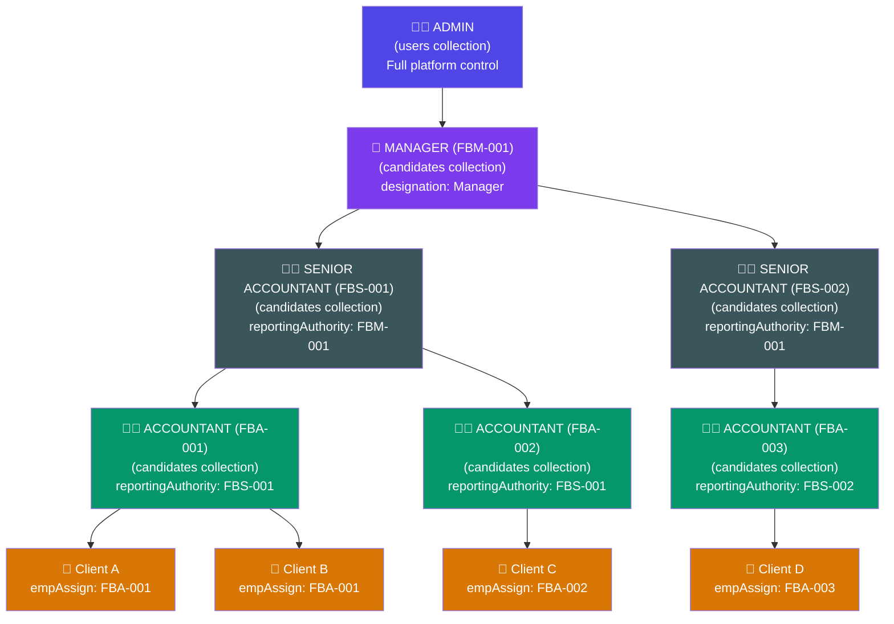

# 📦 Finbook — Complete MongoDB Database Architecture

> **Application:** Accounting Advisory Platform (Finbook)
> **Stack:** MongoDB · Mongoose · Express · React · Node.js
> **Database:** `accounting_advisory`
> **Version:** 2.0 — Production Ready
> **Date:** March 13, 2026

---

## 📑 Table of Contents

| # | Section | Description |
|---|---------|-------------|
| 1 | [System Overview](#1-system-overview) | High-level architecture & roles |
| 2 | [Complete User Flow — Login to End](#2-complete-user-flow--login-to-end) | Every user journey mapped |
| 3 | [Entity Relationship Diagram](#3-entity-relationship-diagram) | Full ER with all collections |
| 4 | [Existing Collections (Currently Built)](#4-existing-collections-currently-built) | 8 collections in production |
| 5 | [New Collections Required (Employee Module)](#5-new-collections-required-employee-module) | 8 new collections needed |
| 6 | [Employee Module — The Critical Design](#6-employee-module--the-critical-design) | Accountant → Team → Client hierarchy |
| 7 | [Access Control Matrix](#7-access-control-matrix) | Who can do what |
| 8 | [Indexes & Performance](#8-indexes--performance) | All indexes |
| 9 | [Security & Production Config](#9-security--production-config) | Hardening guide |
| 10 | [Backup & Recovery](#10-backup--recovery) | Backup strategy |
| 11 | [Deployment Checklist](#11-deployment-checklist) | Go-live steps |
| 12 | [Quick Reference Commands](#12-quick-reference-commands) | Common MongoDB queries |

---

## 1. System Overview

### 1.1 Three-Role Architecture

```
┌─────────────────────────────────────────────────────────────────────┐
│                    FINBOOK PLATFORM — 3 PORTALS                    │
├─────────────────────────────────────────────────────────────────────┤
│                                                                     │
│  ┌─────────────┐    ┌──────────────────┐    ┌─────────────────┐    │
│  │  👨‍💼 ADMIN    │    │  👩‍💻 EMPLOYEE      │    │  🏢 CLIENT       │    │
│  │  Portal      │    │  (Accountant)     │    │  Portal         │    │
│  │              │    │  Portal           │    │                 │    │
│  │  • Manage    │    │  • My Clients     │    │  • View own     │    │
│  │    employees │    │  • Team Mgmt      │    │    compliance   │    │
│  │  • Manage    │    │  • Attendance     │    │  • Upload docs  │    │
│  │    clients   │    │  • Check-in/out   │    │  • View reports │    │
│  │  • Master    │    │  • Financial data │    │  • Communicate  │    │
│  │    data      │    │  • Documents      │    │    with team    │    │
│  │  • Compliance│    │  • Reports        │    │                 │    │
│  │  • Onboard   │    │  • Communication  │    │                 │    │
│  │    candidates│    │  • Resources      │    │                 │    │
│  └──────┬───────┘    └────────┬─────────┘    └────────┬────────┘    │
│         │                     │                       │             │
│         └─────────────────────┼───────────────────────┘             │
│                               │                                     │
│                    ┌──────────▼──────────┐                          │
│                    │   MongoDB Database  │                          │
│                    │  accounting_advisory│                          │
│                    │                     │                          │
│                    │  16 Collections     │                          │
│                    │  (8 existing +      │                          │
│                    │   8 new required)   │                          │
│                    └─────────────────────┘                          │
│                                                                     │
└─────────────────────────────────────────────────────────────────────┘
```

### 1.2 Login Matrix

| Portal | Credentials | Lookup Collection | Token Payload |
|--------|-------------|-------------------|---------------|
| **Admin** | `email` + `password` | `users` (role: admin) | `{ id, role: "admin" }` |
| **Employee** | `employeeId` + `password` | `candidates` (adminInfo) | `{ id, role: "employee" }` |
| **Client** | `clientId` + `password` | `users` (role: client) | `{ id, role: "client" }` |

---

## 2. Complete User Flow — Login to End

### 2.1 Admin Flow



### 2.2 Employee/Accountant Flow



### 2.3 Candidate Onboarding Flow (Public → Employee)


### 2.4 Client Login Flow



---

## 3. Entity Relationship Diagram

### 3.1 Complete ER Diagram (All 16 Collections)



### 3.2 Employee Hierarchy (The Critical Part)



**How the hierarchy works in the database:**
- `candidates.adminInfo.designation` → `"Manager"` / `"Senior Accountant"` / `"Accountant"`
- `candidates.adminInfo.reportingAuthority` → stores the `employeeId` of their boss (e.g., `"FBM-001"`)
- `clients.empAssign` → stores the `ObjectId` of the assigned accountant (from `candidates`)
- A **Senior Accountant** can see all clients assigned to accountants who report to them
- A **Manager** can see _everything_ under their tree

---

## 4. Existing Collections (Currently Built)

> These 8 collections already have Mongoose models and working CRUD APIs.

### 4.1 `users` — Authentication & RBAC

| Field | Type | Required | Unique | Default |
|-------|------|----------|--------|---------|
| `name` | String | ✅ | ❌ | — |
| `email` | String | ✅ | ✅ | — |
| `password` | String | ✅ | ❌ | — (bcrypt hashed, `select:false`) |
| `role` | enum | ❌ | ❌ | `"employee"` → `admin` · `employee` · `client` |
| `employeeId` | String | ❌ | ✅ sparse | — |
| `clientId` | String | ❌ | ✅ sparse | — |
| `isActive` | Boolean | ❌ | ❌ | `true` |

**Hooks:** Pre-save bcrypt hash. **Methods:** `matchPassword()`.

---

### 4.2 `candidates` — Employee Lifecycle (Most Complex)

**Status Flow:** `INTERESTED(20%)` → `ALLOWED_EXITED(20%)` → `EXITED(50%)` → `APPROVED(80%)` → `ACTIVE(100%)`

**Key Nested Fields:**
- `personalInfo` — name, DOB, gender, email, phone, address
- `interestInfo` — why join, career goals
- `exitedPersonalInfo` — marital status, nationality, languages
- `contactInfo` — alternate phone, permanent address
- `familyBackground` — parent/spouse info
- `detailedEducation[]` — array of education records
- `detailedWorkExperience[]` — array of job records
- `professionalInterests` — career interests
- `references[]` — array of references
- `adminInfo` — **employeeId**, password hash, **designation**, **reportingAuthority**, dateOfJoining
- `contractInfo` — 12 boolean acceptance flags + deposit
- `legalCompliance` — Aadhar, PAN, bank details, emergency contact
- `employeeContractAcceptance` — allTermsAccepted (GATE for app access)
- `documents`, `exitedDocuments`, `adminDocuments` — file paths

**Employee ID Pattern:** `FBA-001` (Accountant) · `FBS-001` (Senior) · `FBM-001` (Manager)

---

### 4.3 `clients` — Business Entities

| Field | Type | Notes |
|-------|------|-------|
| `entityName` | String | Required, indexed |
| `clientId` | String | Auto: `CL-XXXXXX` (nanoid) |
| `passwordHash` | String | bcrypt, default plain: `client@123` |
| `empAssign` | → `Candidate` | **Assigned accountant** |
| `entityType` | → `EntityType` | Legal form |
| `natureOfBusiness` | → `NatureOfBusiness` | Industry type |
| `groupCompany` | → `Client` (self-ref) | Parent company |
| `complianceStatus[]` | → `Compliance[]` | Applied rules |
| `taskApplicability[]` | subdocument | `{ taskId, dueDate }` |
| `status` | enum | `active` · `inactive` · `dissolved` |
| `contactName/Phone/Email` | Strings | Primary contact |
| `tin`, `gst`, `pan` | Strings | Tax numbers |
| `visitTimeFrom/To`, `visitDays[]` | Strings | Visit schedule |
| `createdBy` | → `User` | Admin who created |

---

### 4.4 `compliances` — Regulatory Rules Master

| Field | Type | Notes |
|-------|------|-------|
| `complianceId` | String | ✅ Required, ✅ Unique |
| `complianceName` | String | ✅ Required |
| `typeOfCompliance` | String | e.g., "Tax", "Legal" |
| `applicableEntityType` | String | Which entity types |
| `limitApplicable` | String | Threshold |
| `description` | String | Details |
| `dueDateRule` | String | 🔒 Future |
| `frequency` | String | Monthly/Quarterly/Annually |

---

### 4.5 `compliancetasks` — Task Definitions

| Field | Notes |
|-------|-------|
| `taskName` | Unique, required |
| `description` | Optional |
| `dueRule` | 🔒 Future rule engine |
| `frequency` | Optional |

---

### 4.6 `entitytypes` — Legal Entity Classifications

| Field | Notes |
|-------|-------|
| `entityType` | Unique, e.g., "Pvt Ltd", "LLP" |
| `ownership` | Ownership structure |
| `panClassification` | Enum: `P·F·C·G·A·H·T` |

**PAN Codes:** P=Person, F=Firm, C=Company, G=Govt, A=AOP, H=HUF, T=Trust

---

### 4.7 `natureofbusinesses` — Industry Catalog

| Field | Notes |
|-------|-------|
| `businessGroup` | Category |
| `natureOfBusiness` | Unique, specific type |
| `operationalComplexity` | Enum: Low·Moderate·High·Very High |
| `difficultyScore` | Numeric rating |

---

### 4.8 `feedbacks` — Public Reviews

| Field | Notes |
|-------|-------|
| `name`, `email`, `phone` | Contact info |
| `greetingRating` | Enum: Very Good·Good·Poor |
| `discoverySource` | Enum: Friends·Neighbours·By Ads/Others |
| `pricingRating` | Enum: Very Good·Good·Poor |
| `timelineRating` | Enum: 2-3 Weeks·Less than 2 weeks·Longer |
| `message` | Free text |

**Rate Limit:** 3 per IP per hour.

---

## 5. New Collections Required (Employee Module)

> ⚠️ **CRITICAL:** The frontend has 47 components but most use **mock/dummy data**. These 8 new collections must be created to make the employee module production-ready.

### 5.1 `attendances` — Employee Attendance Tracking

> **Frontend Pages:** AttendanceHistory.jsx, DashboardMetrics.jsx (26 days attendance card)

```javascript
const AttendanceSchema = new mongoose.Schema({
  employeeId: {
    type: mongoose.Schema.Types.ObjectId,
    ref: "Candidate",
    required: true,
    index: true,
  },
  date: { type: Date, required: true },
  checkIn: { type: Date, default: null },
  checkOut: { type: Date, default: null },
  totalHours: { type: Number, default: 0 },       // auto-calculated
  status: {
    type: String,
    enum: ["present", "absent", "half-day", "leave", "holiday"],
    default: "absent",
  },
  checkInLocation: {
    latitude: Number,
    longitude: Number,
    address: String,
  },
  notes: { type: String, default: "" },
}, { timestamps: true });

// Compound unique — one record per employee per day
AttendanceSchema.index({ employeeId: 1, date: 1 }, { unique: true });
```

---

### 5.2 `worklogs` — Client Visit Check-in/Check-out

> **Frontend Pages:** CheckInCheckOut.jsx (per-client visit tracking)

```javascript
const WorkLogSchema = new mongoose.Schema({
  employeeId: {
    type: mongoose.Schema.Types.ObjectId,
    ref: "Candidate",
    required: true,
  },
  clientId: {
    type: mongoose.Schema.Types.ObjectId,
    ref: "Client",
    required: true,
  },
  date: { type: Date, required: true },
  checkIn: { type: Date, required: true },
  checkOut: { type: Date, default: null },
  totalHours: { type: Number, default: 0 },
  workDescription: { type: String, default: "" },
  gpsLocation: {
    checkInCoords: { latitude: Number, longitude: Number },
    checkOutCoords: { latitude: Number, longitude: Number },
  },
  status: {
    type: String,
    enum: ["in-progress", "completed"],
    default: "in-progress",
  },
}, { timestamps: true });

WorkLogSchema.index({ employeeId: 1, clientId: 1, date: -1 });
```

---

### 5.3 `messages` — Communication / Chat

> **Frontend Pages:** Communication.jsx (real-time messaging)

```javascript
const MessageSchema = new mongoose.Schema({
  conversationId: { type: String, required: true, index: true },
  senderId: {
    type: mongoose.Schema.Types.ObjectId,
    required: true,
    refPath: "senderModel",
  },
  senderModel: {
    type: String,
    required: true,
    enum: ["Candidate", "User", "Client"],
  },
  receiverId: {
    type: mongoose.Schema.Types.ObjectId,
    required: true,
    refPath: "receiverModel",
  },
  receiverModel: {
    type: String,
    required: true,
    enum: ["Candidate", "User", "Client"],
  },
  text: { type: String, default: "" },
  attachments: [{
    fileName: String,
    filePath: String,
    fileType: String,
    fileSize: Number,
  }],
  isRead: { type: Boolean, default: false },
  readAt: { type: Date, default: null },
}, { timestamps: true });

MessageSchema.index({ conversationId: 1, createdAt: -1 });
MessageSchema.index({ receiverId: 1, isRead: 1 });
```

---

### 5.4 `notifications` — System Notifications

> **Frontend Pages:** DashboardMetrics.jsx, Header.jsx (notification bell)

```javascript
const NotificationSchema = new mongoose.Schema({
  userId: {
    type: mongoose.Schema.Types.ObjectId,
    required: true,
    refPath: "userModel",
  },
  userModel: {
    type: String,
    required: true,
    enum: ["Candidate", "User", "Client"],
  },
  title: { type: String, required: true },
  message: { type: String, required: true },
  type: {
    type: String,
    enum: ["warning", "info", "success", "error", "reminder"],
    default: "info",
  },
  category: {
    type: String,
    enum: ["compliance", "task", "document", "payment", "system"],
    default: "system",
  },
  isRead: { type: Boolean, default: false },
  readAt: { type: Date, default: null },
  actionUrl: { type: String, default: null },  // link to navigate to
  relatedId: { type: mongoose.Schema.Types.ObjectId, default: null },
}, { timestamps: true });

NotificationSchema.index({ userId: 1, isRead: 1, createdAt: -1 });
```

---

### 5.5 `documents` — Client Document Management

> **Frontend Pages:** DocumentsAndFiles.jsx, CompanyKYC.jsx, OwnerKYC.jsx, HistoricalData.jsx

```javascript
const DocumentSchema = new mongoose.Schema({
  clientId: {
    type: mongoose.Schema.Types.ObjectId,
    ref: "Client",
    required: true,
  },
  uploadedBy: {
    type: mongoose.Schema.Types.ObjectId,
    ref: "Candidate",
    required: true,
  },
  fileName: { type: String, required: true },
  filePath: { type: String, required: true },
  fileType: { type: String },           // pdf, doc, jpg, xlsx
  fileSize: { type: Number },           // bytes
  category: {
    type: String,
    enum: [
      "Company KYC", "Owner KYC", "GST Return", "ITR",
      "Audit Report", "Balance Sheet", "P&L Statement",
      "TDS Certificate", "Bank Statement", "Other",
    ],
    required: true,
  },
  financialYear: { type: String },      // "2025-26"
  period: { type: String },             // "Q1", "Jan", "Annual"
  description: { type: String, default: "" },
  status: {
    type: String,
    enum: ["uploaded", "verified", "rejected"],
    default: "uploaded",
  },
  verifiedBy: { type: mongoose.Schema.Types.ObjectId, ref: "Candidate" },
  verifiedAt: { type: Date },
}, { timestamps: true });

DocumentSchema.index({ clientId: 1, category: 1, financialYear: 1 });
```

---

### 5.6 `financialrecords` — Client Financial Data

> **Frontend Pages:** FinancialData.jsx, PndLInputField.jsx, BSInputField.jsx, RevenueFromBusiness.jsx, GSTLiabilityCal.jsx, DebtorsCreditors.jsx, PeriodicData.jsx

```javascript
const FinancialRecordSchema = new mongoose.Schema({
  clientId: {
    type: mongoose.Schema.Types.ObjectId,
    ref: "Client",
    required: true,
  },
  enteredBy: {
    type: mongoose.Schema.Types.ObjectId,
    ref: "Candidate",
    required: true,
  },
  recordType: {
    type: String,
    enum: [
      "ProfitAndLoss", "BalanceSheet", "Revenue",
      "GSTLiability", "DebtorsCreditors", "KeyRatios",
      "SalesAndPurchase",
    ],
    required: true,
  },
  financialYear: { type: String, required: true }, // "2025-26"
  period: { type: String, required: true },        // "Apr", "Q1", "H1", "Annual"
  data: { type: mongoose.Schema.Types.Mixed, required: true },
  // ^ Flexible JSON — structure varies by recordType:
  //   ProfitAndLoss: { revenue, cogs, grossProfit, expenses, netProfit, ... }
  //   BalanceSheet:  { assets, liabilities, equity, ... }
  //   Revenue:       { sales, services, otherIncome, ... }
  //   GSTLiability:  { cgst, sgst, igst, totalLiability, inputCredit, ... }
  //   DebtorsCreditors: { debtors: [...], creditors: [...] }
  //   SalesAndPurchase: { months: [{ month, sales, purchase }] }
  notes: { type: String, default: "" },
}, { timestamps: true });

FinancialRecordSchema.index(
  { clientId: 1, recordType: 1, financialYear: 1, period: 1 },
  { unique: true }
);
```

---

### 5.7 `clienttaskstatuses` — Per-Client Task Progress

> **Frontend Pages:** TaskProgress.jsx, TaskList.jsx

```javascript
const ClientTaskStatusSchema = new mongoose.Schema({
  clientId: {
    type: mongoose.Schema.Types.ObjectId,
    ref: "Client",
    required: true,
  },
  taskId: {
    type: mongoose.Schema.Types.ObjectId,
    ref: "ComplianceTask",
    required: true,
  },
  status: {
    type: String,
    enum: ["Pending", "Process", "Complete"],
    default: "Pending",
  },
  dueDate: { type: Date },
  completedDate: { type: Date },
  assignedTo: {
    type: mongoose.Schema.Types.ObjectId,
    ref: "Candidate",
  },
  remarks: { type: String, default: "" },
  financialYear: { type: String },        // "2025-26"
  updatedBy: {
    type: mongoose.Schema.Types.ObjectId,
    ref: "Candidate",
  },
}, { timestamps: true });

ClientTaskStatusSchema.index(
  { clientId: 1, taskId: 1, financialYear: 1 },
  { unique: true }
);
```

---

### 5.8 `clientqueries` — Client Support Queries

> **Frontend Pages:** ClientQueries.jsx

```javascript
const ClientQuerySchema = new mongoose.Schema({
  clientId: {
    type: mongoose.Schema.Types.ObjectId,
    ref: "Client",
    required: true,
  },
  raisedBy: {
    type: mongoose.Schema.Types.ObjectId,
    required: true,
    refPath: "raisedByModel",
  },
  raisedByModel: {
    type: String,
    enum: ["Candidate", "Client"],
    required: true,
  },
  subject: { type: String, required: true },
  description: { type: String, required: true },
  category: {
    type: String,
    enum: ["GST", "ITR", "TDS", "Audit", "Documentation", "Other"],
    default: "Other",
  },
  priority: {
    type: String,
    enum: ["Low", "Medium", "High", "Critical"],
    default: "Medium",
  },
  status: {
    type: String,
    enum: ["Open", "In Progress", "Resolved", "Closed"],
    default: "Open",
  },
  assignedTo: {
    type: mongoose.Schema.Types.ObjectId,
    ref: "Candidate",
  },
  resolution: { type: String, default: "" },
  resolvedAt: { type: Date },
}, { timestamps: true });

ClientQuerySchema.index({ clientId: 1, status: 1 });
ClientQuerySchema.index({ assignedTo: 1, status: 1 });
```

---

## 6. Employee Module — The Critical Design

### 6.1 How Accountants, Teams & Clients Connect

```
┌─────────────────────────────────────────────────────────────────────┐
│              EMPLOYEE MODULE — DATA ARCHITECTURE                   │
├─────────────────────────────────────────────────────────────────────┤
│                                                                     │
│  TEAM HIERARCHY (stored in candidates.adminInfo):                  │
│                                                                     │
│  ┌───────────────┐                                                 │
│  │ candidates    │                                                 │
│  │───────────────│         HOW TO QUERY TEAM:                      │
│  │ employeeId:   │                                                 │
│  │   FBM-001     │◄─── Manager sees ALL under them                │
│  │ designation:  │     db.candidates.find({                        │
│  │   Manager     │       "adminInfo.reportingAuthority": "FBM-001" │
│  │ reporting:    │     })                                          │
│  │   (admin)     │                                                 │
│  └───────┬───────┘                                                 │
│          │ reports to me                                           │
│   ┌──────┴──────┐                                                  │
│   ▼             ▼                                                  │
│  FBS-001      FBS-002   ◄── Sr. Accountants see their team        │
│   │             │                                                  │
│   ├── FBA-001   ├── FBA-003  ◄── Accountants see their clients    │
│   └── FBA-002   │                                                  │
│                 │            HOW CLIENTS ARE ASSIGNED:             │
│                 │            db.clients.find({                     │
│                 │              empAssign: <candidate_objectId>     │
│                 │            })                                    │
│                 │                                                  │
│  WHAT EACH LEVEL SEES:                                             │
│  ─────────────────────                                             │
│  • Accountant    → Only own assigned clients                      │
│  • Sr Accountant → Own clients + all clients of reportees         │
│  • Manager       → Everything under their tree                    │
│                                                                     │
└─────────────────────────────────────────────────────────────────────┘
```

### 6.2 Team Query Logic (Backend Implementation)

```javascript
// Get all team members under a given employee
async function getTeamMembers(employeeId) {
  const directReports = await Candidate.find({
    "adminInfo.reportingAuthority": employeeId,
    status: "ACTIVE",
  });
  
  let allMembers = [...directReports];
  
  // Recursively get sub-teams
  for (const member of directReports) {
    const subTeam = await getTeamMembers(member.adminInfo.employeeId);
    allMembers = allMembers.concat(subTeam);
  }
  
  return allMembers;
}

// Get all clients visible to an employee (self + team)
async function getVisibleClients(candidateId) {
  const employee = await Candidate.findById(candidateId);
  const employeeId = employee.adminInfo.employeeId;
  
  // Get all team member ObjectIds
  const teamMembers = await getTeamMembers(employeeId);
  const teamIds = [candidateId, ...teamMembers.map(m => m._id)];
  
  // Find all clients assigned to self or any team member
  return Client.find({ empAssign: { $in: teamIds } })
    .populate("entityType natureOfBusiness");
}
```

### 6.3 Data Flow for Each Frontend Feature

| Frontend Component | Backend Collection | Key Operations |
|---|---|---|
| **DashboardMetrics** | `attendances`, `worklogs`, `clienttaskstatuses` | Aggregate stats for the logged-in employee |
| **ClientList** | `clients` | Filter by `empAssign` (self + team) |
| **ClientManagement** | `clients`, `documents`, `financialrecords` | Hub page for single client |
| **ClientMaster / KYCDetails** | `clients`, `documents` (KYC category) | Company and Owner KYC |
| **ComplianceCalendar** | `clienttaskstatuses`, `compliances` | Calendar view of due dates |
| **TaskList / TaskProgress** | `clienttaskstatuses` | CRUD task statuses per client |
| **CheckInCheckOut** | `worklogs` | Create/update work log per client visit |
| **AttendanceHistory** | `attendances` | Calendar + list of attendance records |
| **CompanyKYC / OwnerKYC** | `documents` (category filter) | Upload & view KYC documents |
| **IncomeTaxReturn** | `documents` (ITR), `financialrecords` | ITR-related data |
| **AuditBalanceSheet** | `documents` (Audit), `financialrecords` (BS) | Audit reports |
| **GSTReturn** | `documents` (GST), `financialrecords` (GST) | GST returns |
| **FinancialData** | `financialrecords` | All financial data entry hub |
| **P&L / BS / Revenue** | `financialrecords` (specific recordType) | Financial input & display |
| **GSTLiabilityCal** | `financialrecords` (GSTLiability) | GST calculation |
| **DebtorsCreditors** | `financialrecords` (DebtorsCreditors) | Outstanding amounts |
| **DocumentsAndFiles** | `documents` | Full doc management per client |
| **Communication** | `messages` | Real-time chat |
| **TeamManagement** | `candidates` (hierarchy query) | View/manage team |
| **ReportsAnalytics** | `financialrecords`, aggregation | Summary reports |
| **ClientQueries** | `clientqueries` | Support tickets |
| **Resources** | Static / `documents` | Knowledge base |
| **Profile / Settings** | `candidates` | Self-profile update |

---

## 7. Access Control Matrix

### API Authorization Rules

| Resource | Admin | Manager | Sr. Accountant | Accountant | Client |
|----------|:-----:|:-------:|:--------------:|:----------:|:------:|
| **Users** (CRUD) | ✅ | ❌ | ❌ | ❌ | ❌ |
| **Candidates** (View All) | ✅ | ❌ | ❌ | ❌ | ❌ |
| **Candidates** (Onboard) | ✅ | ❌ | ❌ | ❌ | ❌ |
| **Own Profile** (View/Edit) | ✅ | ✅ | ✅ | ✅ | ✅ |
| **Clients** (Create/Delete) | ✅ | ❌ | ❌ | ❌ | ❌ |
| **Clients** (View Assigned) | ✅ | ✅ own tree | ✅ own tree | ✅ own only | ✅ own only |
| **Master Data** (Entity/NoB/Compliance) | ✅ CRUD | ✅ Read | ✅ Read | ✅ Read | ❌ |
| **Attendance** (Own) | ✅ | ✅ | ✅ | ✅ | ❌ |
| **Attendance** (Team) | ✅ | ✅ | ✅ | ❌ | ❌ |
| **Work Logs** | ✅ | ✅ team | ✅ team | ✅ own | ❌ |
| **Documents** (Upload) | ✅ | ✅ | ✅ | ✅ | ✅ |
| **Documents** (View) | ✅ | ✅ tree | ✅ tree | ✅ own clients | ✅ own only |
| **Financial Records** | ✅ | ✅ tree | ✅ tree | ✅ own clients | ✅ view own |
| **Task Status** (Update) | ✅ | ✅ | ✅ | ✅ | ❌ |
| **Messages** | ✅ | ✅ | ✅ | ✅ | ✅ |
| **Notifications** | ✅ | ✅ | ✅ | ✅ | ✅ |
| **Queries** | ✅ | ✅ | ✅ | ✅ | ✅ |
| **Feedback** (Public) | Public | Public | Public | Public | Public |

---

## 8. Indexes & Performance

### All Indexes (Existing + New)

| Collection | Index | Type | Purpose |
|---|---|---|---|
| `users` | `email` | Unique | Login |
| `users` | `employeeId` | Unique sparse | Cross-ref |
| `users` | `clientId` | Unique sparse | Cross-ref |
| `candidates` | `status` | Regular | Status filtering |
| `candidates` | `adminInfo.employeeId` | Unique sparse | Employee lookup |
| `candidates` | `adminInfo.reportingAuthority` | Regular | **Team hierarchy queries** |
| `clients` | `clientId` | Unique | Login |
| `clients` | `entityName` | Regular | Search |
| `clients` | `empAssign` | Regular | **Find clients by employee** |
| `clients` | `status, createdAt` | Compound | Filtered listing |
| `compliances` | `complianceId` | Unique | Lookup |
| `compliancetasks` | `taskName` | Unique | Lookup |
| `entitytypes` | `entityType` | Unique | Lookup |
| `natureofbusinesses` | `natureOfBusiness` | Unique | Lookup |
| `attendances` | `employeeId, date` | Compound unique | One per day |
| `worklogs` | `employeeId, clientId, date` | Compound | Visit lookup |
| `messages` | `conversationId, createdAt` | Compound | Chat history |
| `messages` | `receiverId, isRead` | Compound | Unread count |
| `notifications` | `userId, isRead, createdAt` | Compound | Feed |
| `documents` | `clientId, category, financialYear` | Compound | Doc lookup |
| `financialrecords` | `clientId, recordType, FY, period` | Compound unique | Data lookup |
| `clienttaskstatuses` | `clientId, taskId, FY` | Compound unique | Task tracking |
| `clientqueries` | `clientId, status` | Compound | Query listing |

---

## 9. Security & Production Config

### Password Security

| Component | Method |
|---|---|
| Admin/Client passwords | bcrypt 10 rounds via Mongoose pre-save |
| Employee passwords | bcrypt 10 rounds in controller |
| Password display | `select: false` on User schema |

### JWT Configuration

| Setting | Dev | Production |
|---|---|---|
| Secret | env variable | 256-bit random key |
| Expiry | 30d | 7d + refresh token |
| Algorithm | HS256 | RS256 for microservices |

### Rate Limiting

| Endpoint | Window | Max |
|---|---|---|
| `/api/*` | 15 min | 1000 |
| `/api/auth/login` | 15 min | 5 |
| `/api/feedback` | 1 hour | 3 |

### Sensitive Data Encryption

| Field | Recommendation |
|---|---|
| `legalCompliance.aadharNumber` | AES-256 encryption |
| `legalCompliance.panNumber` | AES-256 encryption |
| `legalCompliance.bankDetails.accountNumber` | AES-256 encryption |
| `clients.gst`, `clients.pan` | AES-256 encryption |

---

## 10. Backup & Recovery

```bash
#!/bin/bash
# Daily backup script — run via cron: 0 2 * * *
TIMESTAMP=$(date +%Y%m%d_%H%M%S)
BACKUP_DIR="/backups/mongodb/$TIMESTAMP"
mongodump --uri="$MONGO_URI" --db=accounting_advisory --out=$BACKUP_DIR --gzip
find /backups/mongodb -type d -mtime +30 -exec rm -rf {} +
echo "[$TIMESTAMP] Backup completed"
```

```bash
# Restore
mongorestore --uri="$MONGO_URI" --db=accounting_advisory --gzip /backups/mongodb/<TIMESTAMP>/accounting_advisory
```

---

## 11. Deployment Checklist

- [ ] **Atlas M10+** or 3-node Replica Set
- [ ] TLS/SSL enabled
- [ ] Change `JWT_SECRET` to 256-bit random key
- [ ] Change admin password (default: `admin123`)
- [ ] Change default client password (default: `client@123`)
- [ ] Create DB user with minimal permissions: `readWrite` on `accounting_advisory`
- [ ] Set `NODE_ENV=production`
- [ ] Restrict CORS to your domain only
- [ ] Create all indexes from Section 8
- [ ] Run admin seeder: `node backend/seeders/seedAdmin.js`
- [ ] Seed master data: EntityTypes → NatureOfBusiness → Compliances → ComplianceTasks
- [ ] Set up daily backups
- [ ] Configure alerts: disk > 80%, replication lag > 10s, slow queries > 200ms
- [ ] Test restore procedure

---

## 12. Quick Reference Commands

```javascript
// ─── Connect ───
mongosh "mongodb://localhost:27017/accounting_advisory"

// ─── Collection counts ───
db.getCollectionNames().forEach(c => print(`${c}: ${db[c].countDocuments()}`));

// ─── Find active employees ───
db.candidates.find({ status: "ACTIVE" }, { "personalInfo.firstName": 1, "adminInfo.employeeId": 1, "adminInfo.designation": 1 })

// ─── Find team members under FBS-001 ───
db.candidates.find({ "adminInfo.reportingAuthority": "FBS-001" })

// ─── Find clients assigned to an employee ───
db.clients.find({ empAssign: ObjectId("<candidate_id>") })

// ─── Candidate pipeline stats ───
db.candidates.aggregate([
  { $group: { _id: "$status", count: { $sum: 1 } } },
  { $sort: { count: -1 } }
])

// ─── Attendance this month ───
db.attendances.find({
  employeeId: ObjectId("<id>"),
  date: { $gte: new Date("2026-03-01"), $lt: new Date("2026-04-01") }
}).sort({ date: 1 })

// ─── Unread messages ───
db.messages.countDocuments({ receiverId: ObjectId("<id>"), isRead: false })

// ─── Client task summary ───
db.clienttaskstatuses.aggregate([
  { $match: { clientId: ObjectId("<client_id>") } },
  { $group: { _id: "$status", count: { $sum: 1 } } }
])
```

---

> **Document Version:** 2.0
> **Maintainer:** Finbook Development Team
> **Engine:** MongoDB 7.x · Mongoose 8.x
> **Last Reviewed:** March 13, 2026
