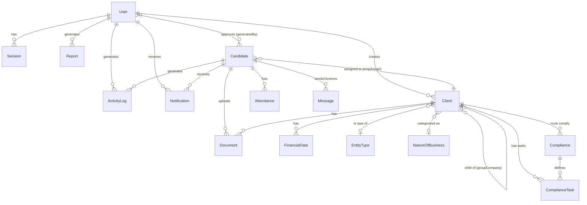

# 🗄️ MongoDB Production-Ready Database Schema

> **Accounting & Advisory Platform — Complete Database Design**
> Multi-user compatible · Activity-logged · Production-optimised

---

## Table of Contents

1. [Architecture Overview](#1-architecture-overview)
2. [Collections & Schemas](#2-collections--schemas)
   - [2.1 Users](#21-users)
   - [2.2 Candidates](#22-candidates-recruitment-pipeline)
   - [2.3 Clients](#23-clients)
   - [2.4 Entity Types](#24-entity-types)
   - [2.5 Nature of Business](#25-nature-of-business)
   - [2.6 Compliances](#26-compliances)
   - [2.7 Compliance Tasks](#27-compliance-tasks)
   - [2.8 Activity Logs (NEW)](#28-activity-logs-new)
   - [2.9 Sessions (NEW)](#29-sessions-new)
   - [2.10 Notifications (NEW)](#210-notifications-new)
   - [2.11 Attendance (NEW)](#211-attendance-new)
   - [2.12 Documents / File Uploads (NEW)](#212-documents--file-uploads-new)
   - [2.13 Communication / Messages (NEW)](#213-communication--messages-new)
   - [2.14 Reports (NEW)](#214-reports-new)
   - [2.15 Financial Data (NEW)](#215-financial-data-new)
3. [Relationships (ER Diagram)](#3-relationships-er-diagram)
4. [Index Strategy](#4-index-strategy)
5. [Multi-User & Multi-Tenant Design](#5-multi-user--multi-tenant-design)
6. [Security Considerations](#6-security-considerations)
7. [Backup & Migration Notes](#7-backup--migration-notes)

---

## 1. Architecture Overview

```
┌──────────────┐     ┌───────────────┐     ┌───────────────┐
│    Users     │────▶│  Candidates   │────▶│    Clients    │
│ (Auth/RBAC)  │     │ (Recruitment) │     │ (Accounting)  │
└──────┬───────┘     └───────┬───────┘     └───────┬───────┘
       │                     │                     │
       ▼                     ▼                     ▼
┌──────────────┐     ┌───────────────┐     ┌───────────────┐
│ Activity Logs│     │  Attendance   │     │  Compliances  │
│ (Audit Trail)│     │ (Check-in/out)│     │ + Tasks       │
└──────────────┘     └───────────────┘     └───────────────┘
       │                                           │
       ▼                                           ▼
┌──────────────┐     ┌───────────────┐     ┌───────────────┐
│  Sessions    │     │  Documents    │     │ EntityType /  │
│ (JWT Track)  │     │  (Uploads)    │     │ NatureOfBiz   │
└──────────────┘     └───────────────┘     └───────────────┘
                     ┌───────────────┐     ┌───────────────┐
                     │ Communication │     │ Financial Data│
                     │  (Messages)   │     │ (GST/ITR/BS)  │
                     └───────────────┘     └───────────────┘
                     ┌───────────────┐
                     │ Notifications │
                     └───────────────┘
                     ┌───────────────┐
                     │   Reports     │
                     └───────────────┘
```

---

## 2. Collections & Schemas

### 2.1 Users

> System auth users (Admin, Advisor, Client roles). Employees log in separately via Candidate.

**Collection:** `users`

```js
{
  _id:          ObjectId,
  name:         { type: String, required: true, trim: true },
  email:        { type: String, required: true, unique: true, lowercase: true, trim: true,
                  match: /^\w+([\.-]?\w+)*@\w+([\.-]?\w+)*(\.\w{2,3})+$/ },
  password:     { type: String, required: true, minlength: 6, select: false },
  role:         { type: String, enum: ["admin", "advisor", "client"], default: "advisor" },
  employeeId:   { type: String, unique: true, sparse: true, trim: true },  // links to Candidate
  isActive:     { type: Boolean, default: true },
  avatar:       { type: String, default: null },                           // profile picture URL
  lastLoginAt:  { type: Date, default: null },
  lastLoginIp:  { type: String, default: null },
  passwordChangedAt: { type: Date, default: null },
  failedLoginAttempts: { type: Number, default: 0 },
  accountLockedUntil:  { type: Date, default: null },
  createdBy:    { type: ObjectId, ref: "User", default: null },           // which admin created
  createdAt:    { type: Date, default: Date.now },
  updatedAt:    { type: Date }
}
// timestamps: true
```

**Indexes:**
```js
{ email: 1 }                    // unique (already enforced)
{ employeeId: 1 }               // unique, sparse
{ role: 1, isActive: 1 }        // filter by role + active status
{ createdAt: -1 }               // sort by newest
```

**Pre-save Hook:**
- Hash `password` with bcrypt (salt rounds: 12 for production)
- Set `passwordChangedAt` when password is modified

---

### 2.2 Candidates (Recruitment Pipeline)

> Tracks the entire candidate journey: INTERESTED → ALLOWED_EXITED → EXITED → APPROVED → ACTIVE
> Once ACTIVE, the candidate is also an employee.

**Collection:** `candidates`

```js
{
  _id:                ObjectId,
  status:             { type: String,
                        enum: ["INTERESTED", "ALLOWED_EXITED", "EXITED",
                               "APPROVED", "ACTIVE", "REJECTED", "ON_HOLD"],
                        default: "INTERESTED", index: true },
  profilePercentage:  { type: Number, default: 0, min: 0, max: 100 },

  // ─────────── INTEREST FORM (20%) ───────────
  personalInfo: {
    firstName:        { type: String, trim: true, required: true },
    lastName:         { type: String, trim: true },
    dateOfBirth:      { type: Date },
    gender:           { type: String, enum: ["Male", "Female", "Other", ""] },
    email:            { type: String, unique: true, sparse: true, lowercase: true, trim: true,
                        match: /^\w+([\.-]?\w+)*@\w+([\.-]?\w+)*(\.\w{2,3})+$/ },
    primaryContact: {
      countryCode:    { type: String, default: "+91" },
      number:         { type: String, unique: true, sparse: true }
    },
    currentAddress: {
      address:        String,
      city:           String,
      state:          String,
      pin:            String
    }
  },

  education: {
    highestQualification: String,
    yearOfPassing:        Number,
    certifications:       [String]
  },

  workExperience: {
    jobTitle:          String,
    companyName:       String,
    yearsOfExperience: Number,
    responsibilities:  String
  },

  interestInfo: {
    whyJoin:           String,
    careerGoals:       String,
    sourceOfAwareness: String
  },

  documents: {
    resume:            String   // file path or S3 URL
  },

  consent: {
    accuracyDeclaration:    { type: Boolean, default: false },
    dataProcessingConsent:  { type: Boolean, default: false }
  },

  // ─────────── EXITED FORM (50%) ───────────
  exitedPersonalInfo: {
    maritalStatus:     { type: String, enum: ["Single", "Married", "Divorced", "Widowed", ""] },
    nationality:       String,
    languagesKnown:    [String]
  },

  contactInfo: {
    alternateMobile:   String,
    permanentAddress: {
      address:         String,
      city:            String,
      state:           String,
      pin:             String,
      sameAsCurrent:   { type: Boolean, default: false }
    }
  },

  familyBackground: {
    fatherOrSpouseName: String,
    occupation:         String,
    numberOfChildren:   Number,
    numberOfSiblings:   Number,
    familyIncome:       String
  },

  detailedEducation: [{
    level:          { type: String, enum: ["10th", "12th", "Graduation", "Post-Graduation", "Other"] },
    degree:         String,
    institution:    String,
    yearOfPassing:  Number,
    percentage:     Number,
    achievements:   String
  }],

  detailedWorkExperience: [{
    employerName:     String,
    jobTitle:         String,
    startDate:        Date,
    endDate:          Date,
    responsibilities: String,
    reasonForLeaving: String,
    skills:           [String]
  }],

  professionalInterests: {
    whyJoinTeam:       String,
    longTermGoals:     String,
    preferredWorkAreas:[String],
    availabilityToJoin:String
  },

  references: [{
    name:         String,
    relationship: String,
    contact:      String,
    email:        String
  }],

  exitedDocuments: {
    passportPhoto: String,
    addressProof:  String,
    identityProof: String
  },

  exitedConsent: {
    dataCollectionConsent:  { type: Boolean, default: false },
    informationAccuracy:   { type: Boolean, default: false },
    termsAgreement:        { type: Boolean, default: false },
    digitalSignature:      { type: Boolean, default: false }
  },

  // ─────────── ADMIN FIELDS (80%) ───────────
  adminInfo: {
    employeeId:    { type: String, unique: true, sparse: true },  // "EMP20260001"
    password:      String,                                         // bcrypt hash
    designation:   String,
    department:    String,
    dateOfJoining: Date,
    salary: {
      basic:       Number,
      hra:         Number,
      allowances:  Number,
      deductions:  Number,
      netSalary:   Number
    },
    generatedBy:   { type: ObjectId, ref: "User" },
    generatedAt:   Date
  },

  employeeContactInfo: {
    primaryEmail:   String,
    contactNumbers: [String],
    residentialAddressWithProof: {
      address:      String,
      gpsCoordinates: { latitude: Number, longitude: Number },
      photos:       [String]
    }
  },

  contractInfo: {
    contractAcceptedHindi:   { type: Boolean, default: false },
    contractAcceptedEnglish: { type: Boolean, default: false },
    digitalSignature:        String,
    depositAmount:           Number,
    depositProof:            String,
    depositConfirmed:        { type: Boolean, default: false }
  },

  legalCompliance: {
    aadharNumber: String,
    panNumber:    String,
    bankDetails: {
      accountNumber: String,
      ifscCode:      String,
      bankName:      String,
      branchName:    String
    },
    emergencyContact: {
      name:         String,
      relationship: String,
      contact:      String
    },
    criminalRecordDeclaration: { type: Boolean, default: false }
  },

  // ─────────── FINAL CONFIRMATION (100%) ───────────
  finalConfirmation: {
    reviewCompleted:          { type: Boolean, default: false },
    accuracyConfirmed:        { type: Boolean, default: false },
    finalDigitalConfirmation: { type: Boolean, default: false },
    confirmedAt:              Date
  },

  // ─────────── METADATA ───────────
  lastModifiedBy: { type: ObjectId, ref: "User" },
  statusHistory: [{
    fromStatus: String,
    toStatus:   String,
    changedBy:  { type: ObjectId, ref: "User" },
    changedAt:  { type: Date, default: Date.now },
    reason:     String
  }],
  tags:          [String],       // e.g. ["priority", "referral"]
  notes: [{
    text:       String,
    addedBy:    { type: ObjectId, ref: "User" },
    addedAt:    { type: Date, default: Date.now }
  }],

  createdAt:  { type: Date, default: Date.now },
  updatedAt:  { type: Date }
}
// timestamps: true
```

**Indexes:**
```js
{ status: 1 }
{ "personalInfo.email": 1 }                    // sparse unique
{ "personalInfo.primaryContact.number": 1 }    // sparse unique
{ "adminInfo.employeeId": 1 }                  // sparse unique
{ status: 1, createdAt: -1 }                   // listing + sort
{ "personalInfo.firstName": "text", "personalInfo.lastName": "text" }  // text search
```

---

### 2.3 Clients

> Business entities managed by the accounting firm.
> Each client is assigned an employee (accountant) and has compliance tracking.

**Collection:** `clients`

```js
{
  _id:                    ObjectId,
  entityName:             { type: String, required: true, index: true },
  clientId:               { type: String, unique: true, index: true },  // "CL-XXXXXX"
  passwordHash:           { type: String, select: false },

  // ─── Assignment ───
  empAssign:              { type: ObjectId, ref: "Candidate" },   // assigned employee/accountant
  visitTimeFrom:          String,
  visitTimeTo:            String,
  visitDays:              [String],   // ["Mon", "Tue", "Wed"...]

  // ─── Entity Details ───
  groupCompany:           { type: ObjectId, ref: "Client" },      // parent company
  entityType:             { type: ObjectId, ref: "EntityType" },
  registrationNumber:     String,
  dateOfIncorporation:    Date,
  registeredOfficeAddress:String,
  natureOfBusiness:       { type: ObjectId, ref: "NatureOfBusiness" },

  // ─── Tax Identifiers ───
  tin:                    String,
  gst:                    String,
  pan:                    String,

  // ─── Contact ───
  contactName:            String,
  contactPhone:           String,
  contactEmail:           String,
  additionalContacts: [{
    name:    String,
    phone:   String,
    email:   String,
    designation: String
  }],

  // ─── Compliance ───
  complianceStatus:       [{ type: ObjectId, ref: "Compliance" }],
  taskApplicability: [{
    taskId:  { type: ObjectId, ref: "ComplianceTask" },
    dueDate: Date,
    status:  { type: String, enum: ["pending", "completed", "overdue"], default: "pending" }
  }],

  // ─── Status ───
  status:  { type: String, enum: ["active", "inactive", "dissolved"], default: "active" },
  remarks: String,

  // ─── Multi-user tracking ───
  createdBy:  { type: ObjectId, ref: "User" },
  updatedBy:  { type: ObjectId, ref: "User" },

  createdAt:  { type: Date },
  updatedAt:  { type: Date }
}
// timestamps: true
```

**Indexes:**
```js
{ clientId: 1 }             // unique
{ entityName: 1 }           // search
{ status: 1 }               // filter
{ empAssign: 1 }            // find clients per accountant
{ entityType: 1 }           // filter by type
{ createdBy: 1 }            // audit
{ "taskApplicability.dueDate": 1, "taskApplicability.status": 1 }  // upcoming deadlines
```

---

### 2.4 Entity Types

> Master data: type of business entity (Pvt Ltd, LLP, Proprietorship, etc.)

**Collection:** `entitytypes`

```js
{
  _id:                ObjectId,
  entityType:         { type: String, required: true, unique: true },
  ownership:          String,
  applicableOwnership:String,
  panClassification:  { type: String, enum: ["P","F","C","G","A","H","T"], required: true },
  isActive:           { type: Boolean, default: true },
  createdAt:          Date,
  updatedAt:          Date
}
// timestamps: true
```

---

### 2.5 Nature of Business

> Master data: categorisation of businesses by sector and complexity.

**Collection:** `natureofbusinesses`

```js
{
  _id:                    ObjectId,
  businessGroup:          { type: String, required: true },
  natureOfBusiness:       { type: String, required: true, unique: true },
  description:            String,
  operationalComplexity:  { type: String, enum: ["Low","Moderate","High","Very High"], required: true },
  difficultyScore:        { type: Number, default: 0, min: 0, max: 10 },
  isActive:               { type: Boolean, default: true },
  createdAt:              Date,
  updatedAt:              Date
}
// timestamps: true
```

---

### 2.6 Compliances

> Master data: compliance rules/regulations applicable per entity type.

**Collection:** `compliances`

```js
{
  _id:                  ObjectId,
  complianceId:         { type: String, required: true, unique: true, trim: true },
  complianceName:       { type: String, required: true, trim: true },
  typeOfCompliance:     { type: String, required: true },          // "GST", "Income Tax", etc.
  applicableEntityType: { type: String, required: true },
  limitApplicable:      { type: String, default: "" },
  description:          { type: String, default: "" },
  dueDateRule:          { type: String, default: null },           // e.g. "15th of next month"
  frequency:            { type: String, enum: ["monthly","quarterly","annually","one-time", null],
                          default: null },
  penaltyInfo:          { type: String, default: "" },             // penalty for non-compliance
  isActive:             { type: Boolean, default: true },
  createdAt:            Date,
  updatedAt:            Date
}
// timestamps: true
```

---

### 2.7 Compliance Tasks

> Specific tasks to be completed for compliance.

**Collection:** `compliancetasks`

```js
{
  _id:          ObjectId,
  taskName:     { type: String, required: true, unique: true, trim: true },
  description:  { type: String, default: "" },
  dueRule:      { type: Object, default: null },    // future: auto due-date calculation
  frequency:    { type: String, default: null },
  compliance:   { type: ObjectId, ref: "Compliance" },  // parent compliance
  isActive:     { type: Boolean, default: true },
  createdAt:    Date,
  updatedAt:    Date
}
// timestamps: true
```

---

### 2.8 Activity Logs (NEW)

> **Full audit trail for every user action in the system.**
> Critical for multi-user compatibility and accountability.

**Collection:** `activitylogs`

```js
{
  _id:          ObjectId,

  // ─── Who ───
  userId:       { type: ObjectId, refPath: "userModel", required: true },
  userModel:    { type: String, enum: ["User", "Candidate"], required: true },
  userName:     String,       // denormalised for quick reads
  userRole:     String,       // "admin", "advisor", "employee", "client"

  // ─── What ───
  action:       { type: String, required: true, index: true },
  // Actions enum examples:
  // AUTH:       "LOGIN", "LOGOUT", "LOGIN_FAILED", "PASSWORD_CHANGED"
  // CANDIDATE:  "CANDIDATE_CREATED", "STATUS_CHANGED", "CANDIDATE_APPROVED",
  //             "CANDIDATE_DELETED", "EMPLOYEE_ID_GENERATED"
  // CLIENT:     "CLIENT_CREATED", "CLIENT_UPDATED", "CLIENT_DELETED",
  //             "ACCOUNTANT_ASSIGNED"
  // COMPLIANCE: "COMPLIANCE_CREATED", "TASK_COMPLETED", "TASK_OVERDUE"
  // ADMIN:      "USER_CREATED", "USER_DEACTIVATED", "SETTINGS_CHANGED"
  // EMPLOYEE:   "CHECK_IN", "CHECK_OUT", "PROFILE_UPDATED"
  // DOCUMENT:   "DOCUMENT_UPLOADED", "DOCUMENT_DELETED"
  // REPORT:     "REPORT_GENERATED", "REPORT_EXPORTED"

  category:     { type: String, enum: ["AUTH", "CANDIDATE", "CLIENT", "COMPLIANCE",
                                        "ADMIN", "EMPLOYEE", "DOCUMENT", "REPORT",
                                        "COMMUNICATION", "FINANCIAL", "SYSTEM"],
                  required: true, index: true },

  // ─── On Which Resource ───
  resourceType: { type: String },   // "Candidate", "Client", "User", "Compliance", etc.
  resourceId:   { type: ObjectId },
  resourceName: String,             // denormalised for quick display

  // ─── Details ───
  description:  String,             // human-readable: "Admin approved candidate John Doe"
  changes: {                        // before/after for update operations
    before:     { type: Object },   // previous values (only changed fields)
    after:      { type: Object }    // new values (only changed fields)
  },
  metadata:     { type: Object },   // extra context (IP, user-agent, etc.)

  // ─── Context ───
  ipAddress:    String,
  userAgent:    String,
  sessionId:    { type: ObjectId, ref: "Session" },

  // ─── Timestamps ───
  timestamp:    { type: Date, default: Date.now, index: true }
}
```

**Indexes:**
```js
{ userId: 1, timestamp: -1 }            // user's activity timeline
{ action: 1, timestamp: -1 }            // filter by action type
{ category: 1, timestamp: -1 }          // filter by category
{ resourceType: 1, resourceId: 1 }      // all logs for a specific resource
{ timestamp: 1 }                         // TTL index (auto-delete after N days)
// TTL example: { timestamp: 1 }, { expireAfterSeconds: 15552000 }  // 180 days
```

> **⚡ Production Tip:** Use a capped collection or TTL index to prevent unbounded growth.

---

### 2.9 Sessions (NEW)

> Track active JWT sessions per user for security and multi-device management.

**Collection:** `sessions`

```js
{
  _id:            ObjectId,
  userId:         { type: ObjectId, refPath: "userModel", required: true },
  userModel:      { type: String, enum: ["User", "Candidate"], required: true },
  token:          { type: String, required: true, index: true },     // JWT hash (not full token)
  deviceInfo: {
    userAgent:    String,
    browser:      String,
    os:           String,
    device:       String
  },
  ipAddress:      String,
  isActive:       { type: Boolean, default: true },
  loginAt:        { type: Date, default: Date.now },
  lastActivityAt: { type: Date, default: Date.now },
  logoutAt:       Date,
  expiresAt:      { type: Date, required: true }      // mirror JWT expiry
}
```

**Indexes:**
```js
{ userId: 1, isActive: 1 }          // find active sessions per user
{ token: 1 }                         // lookup by token hash
{ expiresAt: 1 }, { expireAfterSeconds: 0 }  // TTL: auto-cleanup expired sessions
```

---

### 2.10 Notifications (NEW)

> In-app notifications for status changes, reminders, assignments.

**Collection:** `notifications`

```js
{
  _id:            ObjectId,
  recipientId:    { type: ObjectId, refPath: "recipientModel", required: true },
  recipientModel: { type: String, enum: ["User", "Candidate"], required: true },

  type:           { type: String, enum: [
                      "STATUS_CHANGE", "ASSIGNMENT", "REMINDER", "DEADLINE",
                      "APPROVAL_REQUIRED", "DOCUMENT_REQUEST", "SYSTEM",
                      "MESSAGE", "COMPLIANCE_DUE"
                    ], required: true },

  title:          { type: String, required: true },
  message:        { type: String, required: true },
  link:           String,           // deep link to the relevant page

  // ─── Related Resource ───
  resourceType:   String,
  resourceId:     ObjectId,

  // ─── Status ───
  isRead:         { type: Boolean, default: false },
  readAt:         Date,
  isArchived:     { type: Boolean, default: false },

  // ─── Creator ───
  createdBy:      { type: ObjectId, ref: "User" },  // system or admin
  priority:       { type: String, enum: ["low", "normal", "high", "urgent"], default: "normal" },

  createdAt:      { type: Date, default: Date.now },
  updatedAt:      Date
}
// timestamps: true
```

**Indexes:**
```js
{ recipientId: 1, isRead: 1, createdAt: -1 }   // unread notifications first
{ recipientId: 1, isArchived: 1 }               // non-archived
{ type: 1 }
{ createdAt: 1 }, { expireAfterSeconds: 7776000 }  // TTL: 90 days auto-cleanup
```

---

### 2.11 Attendance (NEW)

> Employee check-in/check-out tracking with GPS coordinates.

**Collection:** `attendances`

```js
{
  _id:            ObjectId,
  employeeId:     { type: ObjectId, ref: "Candidate", required: true, index: true },
  date:           { type: Date, required: true },     // date portion only (start of day)

  checkIn: {
    time:         { type: Date },
    location: {
      latitude:   Number,
      longitude:  Number,
      address:    String
    },
    photo:        String,                              // selfie/photo proof
    method:       { type: String, enum: ["app", "web", "biometric", "manual"], default: "web" }
  },

  checkOut: {
    time:         Date,
    location: {
      latitude:   Number,
      longitude:  Number,
      address:    String
    },
    photo:        String,
    method:       { type: String, enum: ["app", "web", "biometric", "manual"], default: "web" }
  },

  // ─── Computed ───
  totalHours:     { type: Number, default: 0 },        // auto-calculated on check-out
  overtime:       { type: Number, default: 0 },         // hours beyond 8
  status:         { type: String, enum: ["present", "absent", "half-day", "late",
                                          "on-leave", "holiday", "weekend"],
                    default: "present" },
  leaveType:      { type: String, enum: ["casual", "sick", "earned", "unpaid", "comp-off", null],
                    default: null },

  // ─── Approval ───
  approvedBy:     { type: ObjectId, ref: "User" },
  remarks:        String,

  // ─── Client Visit Tracking ───
  clientVisits: [{
    clientId:     { type: ObjectId, ref: "Client" },
    arrivalTime:  Date,
    departureTime:Date,
    taskSummary:  String
  }],

  createdAt:      Date,
  updatedAt:      Date
}
// timestamps: true
```

**Indexes:**
```js
{ employeeId: 1, date: -1 }          // unique constraint per employee per day
{ date: -1 }                          // date-based queries
{ status: 1, date: -1 }               // filter by status
{ employeeId: 1, date: 1 }, { unique: true }  // one record per employee per day
```

---

### 2.12 Documents / File Uploads (NEW)

> Centralised document management for all uploaded files.

**Collection:** `documents`

```js
{
  _id:             ObjectId,
  fileName:        { type: String, required: true },
  originalName:    { type: String, required: true },
  mimeType:        String,
  fileSize:        Number,            // bytes
  filePath:        String,            // "/uploads/..." or S3 URL
  storageProvider: { type: String, enum: ["local", "s3", "cloudinary"], default: "local" },

  // ─── Ownership ───
  uploadedBy:      { type: ObjectId, refPath: "uploaderModel", required: true },
  uploaderModel:   { type: String, enum: ["User", "Candidate"], required: true },

  // ─── Association ───
  relatedTo:       { type: ObjectId, refPath: "relatedModel" },
  relatedModel:    { type: String, enum: ["Candidate", "Client", "Compliance", "User"] },

  category:        { type: String, enum: [
                      "resume", "identity_proof", "address_proof", "passport_photo",
                      "contract", "deposit_proof", "financial_report", "tax_document",
                      "compliance_document", "other"
                    ], default: "other" },

  // ─── Access Control ───
  visibility:      { type: String, enum: ["private", "internal", "public"], default: "internal" },
  allowedRoles:    [String],          // ["admin", "advisor"] for restricted access

  // ─── Versioning ───
  version:         { type: Number, default: 1 },
  previousVersion: { type: ObjectId, ref: "Document" },

  isDeleted:       { type: Boolean, default: false },  // soft delete
  deletedAt:       Date,
  deletedBy:       { type: ObjectId, ref: "User" },

  createdAt:       Date,
  updatedAt:       Date
}
// timestamps: true
```

**Indexes:**
```js
{ relatedTo: 1, relatedModel: 1 }       // documents for a specific entity
{ uploadedBy: 1 }                        // user's uploads
{ category: 1 }                          // filter by type
{ isDeleted: 1 }                         // exclude soft-deleted
```

---

### 2.13 Communication / Messages (NEW)

> Internal messaging and communication system between team members.

**Collection:** `messages`

```js
{
  _id:            ObjectId,

  // ─── Conversation ───
  conversationId: { type: String, required: true, index: true },  // group messages
  type:           { type: String, enum: ["direct", "group", "announcement", "query"],
                    default: "direct" },

  // ─── Sender ───
  senderId:       { type: ObjectId, refPath: "senderModel", required: true },
  senderModel:    { type: String, enum: ["User", "Candidate"], required: true },
  senderName:     String,

  // ─── Recipients ───
  recipients: [{
    userId:       { type: ObjectId, refPath: "recipientModel" },
    recipientModel: { type: String, enum: ["User", "Candidate"] },
    readAt:       Date,
    isRead:       { type: Boolean, default: false }
  }],

  // ─── Content ───
  subject:        String,
  body:           { type: String, required: true },
  attachments:    [{ type: ObjectId, ref: "Document" }],

  // ─── Context ───
  relatedTo:      { type: ObjectId, refPath: "relatedModel" },
  relatedModel:   { type: String, enum: ["Client", "Candidate", "Compliance"] },

  // ─── Status ───
  isEdited:       { type: Boolean, default: false },
  editedAt:       Date,
  isDeleted:      { type: Boolean, default: false },
  deletedAt:      Date,

  // ─── Priority ───
  priority:       { type: String, enum: ["low", "normal", "high", "urgent"], default: "normal" },
  isPinned:       { type: Boolean, default: false },

  createdAt:      Date,
  updatedAt:      Date
}
// timestamps: true
```

**Indexes:**
```js
{ conversationId: 1, createdAt: -1 }          // conversation thread
{ senderId: 1, createdAt: -1 }                // sent messages
{ "recipients.userId": 1, "recipients.isRead": 1 }  // unread messages
{ relatedTo: 1, relatedModel: 1 }             // messages about a client/candidate
```

---

### 2.14 Reports (NEW)

> Store generated report metadata (actual report data can be in S3/filesystem).

**Collection:** `reports`

```js
{
  _id:            ObjectId,
  reportType:     { type: String, enum: [
                      "financial_summary", "gst_return", "income_tax",
                      "balance_sheet", "profit_loss", "attendance_summary",
                      "compliance_status", "employee_performance",
                      "client_portfolio", "revenue_report", "custom"
                    ], required: true },

  title:          { type: String, required: true },
  description:    String,

  // ─── Scope ───
  clientId:       { type: ObjectId, ref: "Client" },
  employeeId:     { type: ObjectId, ref: "Candidate" },
  dateRange: {
    from:         Date,
    to:           Date
  },
  financialYear:  String,   // "2025-26"

  // ─── Output ───
  format:         { type: String, enum: ["pdf", "excel", "csv", "json"], default: "pdf" },
  filePath:       String,
  fileSize:       Number,

  // ─── Status ───
  status:         { type: String, enum: ["pending", "generating", "completed", "failed"],
                    default: "pending" },
  errorMessage:   String,

  // ─── Multi-user ───
  generatedBy:    { type: ObjectId, ref: "User", required: true },
  sharedWith:     [{ type: ObjectId, ref: "User" }],

  createdAt:      Date,
  updatedAt:      Date
}
// timestamps: true
```

**Indexes:**
```js
{ reportType: 1, createdAt: -1 }
{ generatedBy: 1 }
{ clientId: 1 }
{ status: 1 }
```

---

### 2.15 Financial Data (NEW)

> Client financial data: GST calculations, P&L, Balance Sheet, ITR data.
> This supports the frontend employee modules (GST Calculation, Balance Sheet, P&L, etc.)

**Collection:** `financialdata`

```js
{
  _id:              ObjectId,
  clientId:         { type: ObjectId, ref: "Client", required: true, index: true },
  financialYear:    { type: String, required: true },  // "2025-26"
  period:           { type: String },                   // "Q1", "Apr-2025", "Monthly", etc.

  type:             { type: String, enum: [
                        "gst", "income_tax", "balance_sheet",
                        "profit_loss", "sales_purchase", "debtor_creditor",
                        "revenue", "tds"
                      ], required: true, index: true },

  // ─── GST Data ───
  gstData: {
    gstIn:          String,
    filingType:     { type: String, enum: ["GSTR1", "GSTR3B", "GSTR9", "GSTR9C"] },
    taxableValue:   Number,
    cgst:           Number,
    sgst:           Number,
    igst:           Number,
    cess:           Number,
    totalTax:       Number,
    inputCredit:    Number,
    netLiability:   Number,
    filingStatus:   { type: String, enum: ["pending", "filed", "late"], default: "pending" },
    filingDate:     Date,
    dueDate:        Date
  },

  // ─── Income Tax Data ───
  incomeTaxData: {
    grossIncome:     Number,
    deductions:      Number,
    taxableIncome:   Number,
    taxPayable:      Number,
    tdsPaid:         Number,
    advanceTax:      Number,
    selfAssessment:  Number,
    refund:          Number,
    itrForm:         String,    // "ITR-1", "ITR-3", etc.
    filingDate:      Date,
    assessmentYear:  String
  },

  // ─── Balance Sheet ───
  balanceSheet: {
    assets: {
      currentAssets:  Number,
      fixedAssets:    Number,
      investments:    Number,
      totalAssets:    Number
    },
    liabilities: {
      currentLiabilities: Number,
      longTermDebt:       Number,
      totalLiabilities:   Number
    },
    equity: {
      shareCapital:       Number,
      reserves:           Number,
      totalEquity:        Number
    }
  },

  // ─── Profit & Loss ───
  profitLoss: {
    revenue:           Number,
    costOfGoodsSold:   Number,
    grossProfit:       Number,
    operatingExpenses: Number,
    operatingProfit:   Number,
    otherIncome:       Number,
    interestExpense:   Number,
    depreciation:      Number,
    profitBeforeTax:   Number,
    taxExpense:        Number,
    netProfit:         Number
  },

  // ─── Sales & Purchase (MoM) ───
  salesPurchase: {
    month:             String,
    totalSales:        Number,
    totalPurchases:    Number,
    netSales:          Number,
    returnInward:      Number,
    returnOutward:     Number
  },

  // ─── Raw Data / Custom Fields ───
  customData:        { type: Object },

  // ─── Multi-user ───
  enteredBy:         { type: ObjectId, ref: "Candidate" },  // employee who entered
  verifiedBy:        { type: ObjectId, ref: "User" },       // supervisor
  verifiedAt:        Date,
  status:            { type: String, enum: ["draft", "submitted", "verified", "rejected"],
                       default: "draft" },
  rejectionReason:   String,

  createdAt:         Date,
  updatedAt:         Date
}
// timestamps: true
```

**Indexes:**
```js
{ clientId: 1, financialYear: 1, type: 1 }    // compound for lookups
{ clientId: 1, type: 1, period: 1 }           // period wise data
{ enteredBy: 1 }                               // data by employee
{ status: 1 }                                  // filter drafts vs verified
```

---

## 3. Relationships (ER Diagram)



---

## 4. Index Strategy

### Compound Indexes for Production Queries

| Collection     | Index                                              | Purpose                          |
|----------------|----------------------------------------------------|----------------------------------|
| `activitylogs` | `{ userId: 1, category: 1, timestamp: -1 }`      | User activity by category        |
| `activitylogs` | `{ resourceType: 1, resourceId: 1, timestamp: -1 }` | All logs for a resource       |
| `candidates`   | `{ status: 1, createdAt: -1 }`                    | Dashboard listing                |
| `clients`      | `{ empAssign: 1, status: 1 }`                     | Clients per accountant           |
| `clients`      | `{ entityType: 1, status: 1 }`                    | Clients by entity type           |
| `attendances`  | `{ employeeId: 1, date: 1 }` (unique)             | One record/day/employee          |
| `financialdata`| `{ clientId: 1, financialYear: 1, type: 1 }`      | Financial lookups                |
| `messages`     | `{ conversationId: 1, createdAt: -1 }`            | Message thread ordering          |
| `notifications`| `{ recipientId: 1, isRead: 1, createdAt: -1 }`    | Unread count + listing           |

### TTL Indexes (Auto-Cleanup)

| Collection      | Field         | Expiry       | Purpose                     |
|-----------------|---------------|--------------|------------------------------|
| `activitylogs`  | `timestamp`   | 180 days     | Prevent unbounded growth     |
| `sessions`      | `expiresAt`   | 0 (on time)  | Clean expired JWT sessions   |
| `notifications` | `createdAt`   | 90 days      | Remove old notifications     |

### Text Indexes (Full-Text Search)

| Collection   | Fields                                           |
|--------------|--------------------------------------------------|
| `candidates` | `personalInfo.firstName`, `personalInfo.lastName` |
| `clients`    | `entityName`, `contactName`                       |

---

## 5. Multi-User & Multi-Tenant Design

### Role-Based Access Control (RBAC)

```
┌─────────────────────────────────────────────────────────────────────┐
│                        ROLES & PERMISSIONS                         │
├──────────┬──────────┬──────────┬──────────┬─────────────────────────┤
│  Action  │  Admin   │ Advisor  │ Employee │        Client           │
├──────────┼──────────┼──────────┼──────────┼─────────────────────────┤
│ Users    │ CRUD     │ Read     │ —        │ —                       │
│ Candidate│ CRUD     │ Read     │ Own      │ —                       │
│ Client   │ CRUD     │ Read     │ Assigned │ Own                     │
│ Complianc│ CRUD     │ Read     │ Assigned │ Own (read)              │
│ Attendanc│ CRUD     │ Read     │ Own      │ —                       │
│ Financial│ CRUD     │ Read     │ Assigned │ Own (read)              │
│ Reports  │ Full     │ Read     │ Assigned │ Own                     │
│ Activity │ Full     │ Own      │ Own      │ Own                     │
│ Messages │ Full     │ Own      │ Own      │ Own                     │
└──────────┴──────────┴──────────┴──────────┴─────────────────────────┘
```

### Multi-User Concurrency Strategy

1. **Optimistic Locking**: Use Mongoose `__v` (version key) to detect concurrent updates
2. **`lastModifiedBy`**: Every update records which user made the change
3. **`statusHistory`**: On candidates, track every status transition with who/when/why
4. **Activity Logs**: Every write operation creates a log entry with `changes.before` / `changes.after`

### Data Isolation Rules

| Scenario                     | Rule                                                  |
|------------------------------|-------------------------------------------------------|
| Employee views own data      | Filter by `employeeId = req.user._id`                 |
| Advisor views clients        | Filter by `empAssign` or assigned clients list         |
| Admin views everything       | No filter — full access                                |
| Client views own data        | Filter by `clientId = req.user.clientId`               |
| Cross-user reads             | Always enforced at API middleware level                 |

---

## 6. Security Considerations

### Data at Rest

| Field                   | Protection                                      |
|-------------------------|--------------------------------------------------|
| `User.password`         | bcrypt (12 salt rounds), `select: false`          |
| `Candidate.adminInfo.password` | bcrypt (10 salt rounds)                    |
| `Client.passwordHash`   | bcrypt (10 salt rounds), `select: false`          |
| `legalCompliance.aadharNumber` | Encrypt with AES-256 before save (PII)     |
| `legalCompliance.panNumber`    | Encrypt with AES-256 before save (PII)     |
| `legalCompliance.bankDetails`  | Encrypt with AES-256 before save (PII)     |
| `Session.token`          | Store SHA-256 hash, not the raw JWT              |

### Mongoose Schema Guards

```js
// Apply to all schemas globally:
schema.set('toJSON', {
  transform: (doc, ret) => {
    delete ret.__v;
    delete ret.password;
    delete ret.passwordHash;
    return ret;
  }
});
```

### Soft Delete Pattern

```js
// For critical data, use soft deletes:
{
  isDeleted:  { type: Boolean, default: false, index: true },
  deletedAt:  Date,
  deletedBy:  { type: ObjectId, ref: "User" }
}

// Add to all queries globally:
schema.pre(/^find/, function(next) {
  this.where({ isDeleted: { $ne: true } });
  next();
});
```

---

## 7. Backup & Migration Notes

### Production Deployment Checklist

- [ ] Enable **MongoDB Atlas** with replica set (minimum 3 nodes)
- [ ] Enable **encryption at rest** (Atlas auto or manual LUKS)
- [ ] Enable **audit logging** at MongoDB level
- [ ] Set up **automated daily backups** with 30-day retention
- [ ] Configure **connection pooling** (`maxPoolSize: 50`)
- [ ] Enable **slow query profiling** (threshold: 100ms)
- [ ] Set up **monitoring** with MongoDB Atlas alerts or Datadog

### Migration from Current Schema

```
Current State:                 New State:
─────────────                  ──────────
7 collections                  15 collections
No activity logs     ──────▶   Full activity logs
No attendance        ──────▶   Attendance tracking
No notifications     ──────▶   In-app notifications
No sessions          ──────▶   Session management
No financial data    ──────▶   Structured financial data
No document mgmt     ──────▶   Centralised document store
No messaging         ──────▶   Internal communication
```

### Migration Script Outline

```js
// 1. Create new collections (no data loss — additive only)
// 2. Add new fields to existing collections:
//    - Candidate: statusHistory, tags, notes
//    - Client: additionalContacts, updatedBy
//    - Compliance: penaltyInfo, isActive
//    - EntityType / NatureOfBusiness: isActive
//    - ComplianceTask: compliance (ref)
// 3. Backfill statusHistory from existing candidates
// 4. Create indexes
// 5. Set up TTL indexes for activitylogs, sessions, notifications
```

### Environment Variables (New)

```env
# Add to backend/.env
ENCRYPTION_KEY=your-256-bit-key        # for PII encryption
SESSION_TTL_DAYS=30                    # JWT session expiry
ACTIVITY_LOG_TTL_DAYS=180              # auto-purge old logs
NOTIFICATION_TTL_DAYS=90               # auto-purge old notifications
MAX_POOL_SIZE=50                       # MongoDB connection pool
```

---

> **📊 Total Collections: 15**
> Existing (7): `users`, `candidates`, `clients`, `entitytypes`, `natureofbusinesses`, `compliances`, `compliancetasks`
> New (8): `activitylogs`, `sessions`, `notifications`, `attendances`, `documents`, `messages`, `reports`, `financialdata`

---

*Generated for the Accounting & Advisory Platform — Production Schema v1.0*
*Last Updated: March 5, 2026*
